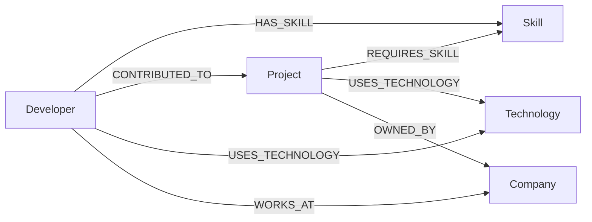

# Wexa DevGraph Explorer

A graph-backed developer/project matching platform built on **CognoDB** (openCypher over Bolt), showing how developers, skills, projects, technologies, and companies interconnect — and using those connections to power project recommendations and skill-gap analysis.

> ⚠️ **TODO before submission:** the seed script links developers to projects with `CONTRIBUTED_TO`, but the `/recommendations` and `/skill-gaps` API queries filter on `WORKS_ON`. Align these (rename the relationship in `seed.js` to `WORKS_ON`, or update both queries in `server.js` to use `CONTRIBUTED_TO`) — otherwise both endpoints silently ignore existing developer↔project assignments.

## Why a graph database?

The core question this app answers isn't "list all developers" or "list all projects" — it's **multi-hop relationship questions**:

- *Which projects should a developer be recommended for, based on skills they already have that a project requires, excluding projects they're already on?* (Developer → Skill ← Project, a 2-hop traversal with an exclusion filter.)
- *Which required skills for a project are not covered by anyone currently on it?* (Project → Skill, anti-joined against Project ← Developer → Skill.)

In a relational schema, both of these mean bridging three or four junction tables (`developer_skills`, `project_skill_requirements`, `project_assignments`) with multi-way `JOIN`s and `NOT EXISTS` subqueries that get harder to read and slower to run as the graph gets denser or the hop count grows (e.g. "developers who could mentor someone on a project two skills removed from their own"). In Cypher, the same question is a direct pattern match — `(d:Developer)-[:HAS_SKILL]->(s)<-[:REQUIRES_SKILL]-(p:Project)` — that reads like the question itself and scales by relationship traversal rather than table scans.

## Data model



**Nodes**
| Label | Key properties |
|---|---|
| `Developer` | `id`, `name`, `title`, `experienceYears`, `location` |
| `Skill` | `id`, `name`, `category` |
| `Project` | `id`, `name`, `status`, `complexity` |
| `Technology` | `id`, `name`, `category` |
| `Company` | `id`, `name`, `industry`, `location` |

**Relationships**
| Type | Direction | Properties |
|---|---|---|
| `HAS_SKILL` | Developer → Skill | `proficiency` |
| `CONTRIBUTED_TO` | Developer → Project | `role` |
| `REQUIRES_SKILL` | Project → Skill | `importance` |
| `USES_TECHNOLOGY` | Developer/Project → Technology | `proficiency` (developer only) |
| `WORKS_AT` | Developer → Company | — |
| `OWNED_BY` | Project → Company | — |

## Tech stack

- **Database:** CognoDB (openCypher/Bolt), official Neo4j JavaScript driver (`neo4j-driver` v6)
- **Backend:** Node.js, Express 5, `cors`, `dotenv`
- **Frontend:** React 19 + TypeScript, built with Vite, `react-force-graph-2d` for the interactive network view, ESLint for linting

## Setup

### 1. Provision CognoDB
1. Sign up at [console.cognodb.com](https://console.cognodb.com/signup) (free, no card required).
2. Create a free `c0` instance and pick a region.
3. Copy the connection URI (`bolt+s://<instance-id>.databases.cognodb.cloud`) and the generated password for user `cognodb` — shown only once.

### 2. Configure environment variables
Create a `.env` file in the backend root (never committed — see `.gitignore`):
```
NEO4J_URI=bolt+s://<instance-id>.databases.cognodb.cloud
NEO4J_USER=cognodb
NEO4J_PASSWORD=<your generated password>
PORT=5000
```

### 3. Install and seed
```bash
# backend
cd backend
npm install
npm run seed        # wipes and reloads the graph (runs seed/seed.js)
npm start            # http://localhost:5000
# or: npm run dev    # auto-restarts on file changes (node --watch)
```

### 4. Run the frontend
```bash
cd frontend
npm install
npm run dev          # http://localhost:5173 (Vite dev server)
```

## API / main queries

| Endpoint | What it does |
|---|---|
| `GET /api/health/db` | Confirms the CognoDB connection is alive |
| `GET /api/graph/stats` | Node counts per label, for the dashboard summary cards |
| `GET /api/developers` | Flat list of developers for the picker |
| `GET /api/graph` | Full node/edge extraction (capped at 200 rows) for the force-directed graph view |
| `GET /api/developers/:devId/recommendations` | **2-hop traversal**: skills the developer has → projects requiring those skills, excluding projects they're already on |
| `GET /api/projects/:projectId/skill-gaps` | **Anti-pattern query**: skills a project requires that no assigned developer currently has |

All queries are parameterized via the driver (`$devId`, `$projectId`) — no string-concatenated Cypher.

## UI/UX notes

- Loading state (`Loading graph network…`) and a distinct error state if the API/DB is unreachable.
- Empty state in `GraphVisualizer` when no graph data is returned.
- Stat cards give an at-a-glance overview before drilling into the interactive graph or recommendations.

## Error handling

Every backend route wraps its query in `try/catch`, closes the Neo4j session in `finally`, and returns a structured `{ success: false, message, error }` payload on failure rather than throwing raw errors.

## Screenshots

*(add screenshots of the dashboard, graph view, and recommendation panel here)*

## Demo

- Hosted demo: *(add link)*
- Screen recording: *(add link)*